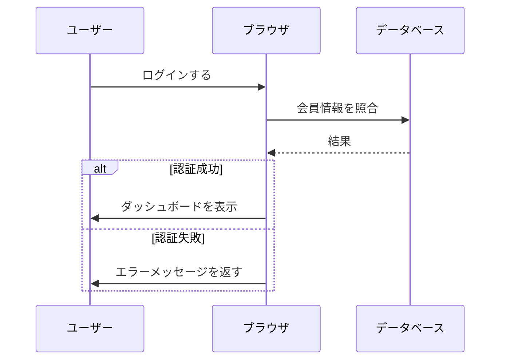

### 図1


```mermaid
sequenceDiagram
    participant ユーザー
    participant ブラウザ
    participant データベース
    ユーザー->>ブラウザ:ログインする
    ブラウザ->>データベース:会員情報を照合
    データベース-->>ブラウザ:結果

    alt 認証成功
        ブラウザ->>ユーザー:ダッシュボードを表示
    else　認証失敗
        ブラウザ->>ユーザー:エラーメッセージを返す
    end

```

### 図2


```mermaid
graph
   accTitle: My title here
   accDescr: My description here
   A-->B
```

### テーブルなど

aa | bb | cc
---|---|---
11|22|33
44|55|66

`inline code`

code block:
```
This
is
a
pen.
```

箇条書き

- 1
- 2
- 3

1. aaa
2. bbb
3. ccc

